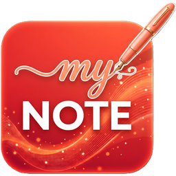
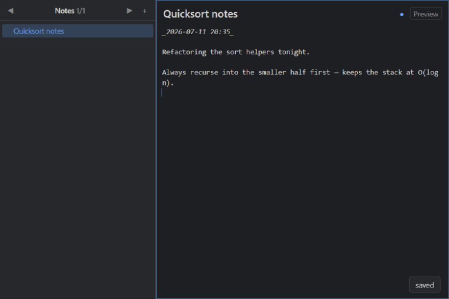
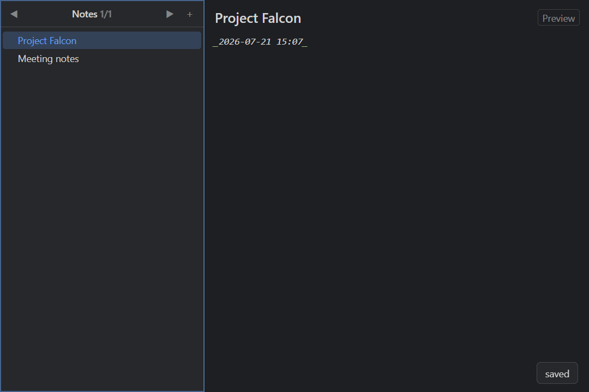
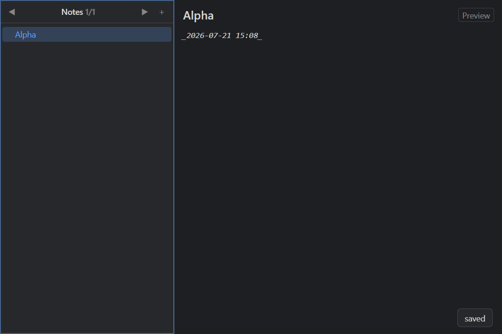
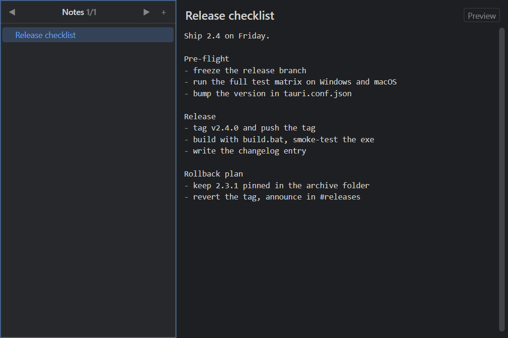

<p align="center">
  
</p>

<h1 align="center">MyNote</h1>

<p align="center">
  Local-first, keyboard-driven Markdown notes for Windows.<br>
  One small exe. No installer, no cloud, no network — ever.
</p>

---

Your notebook is just a folder of plain `.md` files — greppable, diffable, AI-agent friendly. MyNote wraps it in a fast shell: sections, an infinitely nestable page tree, instant search, and a keyboard shortcut for everything.

## See it in action

**Insert and edit code, flip to preview** — `Ctrl+J` opens a searchable insert palette (code blocks, tables, links, task lists…); fenced code is syntax-highlighted in the editor and the rendered preview (`Ctrl+E`):



**Sections and nested pages** — create subpages (`Ctrl+Enter`), fold subtrees (`←`/`→`), hop between sections (`Ctrl+PgUp/PgDn`), all without the mouse:



**Never memorize a shortcut** — `?` opens a context-aware cheat sheet with live filtering:



**Optional: full history** — if `git` is installed, MyNote snapshots the notebook so every page keeps a timeline of revisions. `Ctrl+H` diffs one against what's on disk and restores it as a single undoable edit; `Ctrl+Shift+H` brings back deleted pages:



## Features

- **Plain Markdown on disk** — one `.md` file per page, searchable index. Edit the folder with anything, MyNote won't mind
- **Keyboard-first** — every action has a shortcut
- **Fuzzy + regex search** across every section (`Ctrl+K`), with highlighted snippets
- **Quick insert** (`Ctrl+J`) — searchable markdown helper to help insert code blocks, tables, links, task lists, dates…
- **Undo/Redo** (`Ctrl+Z/Y`) for edits,  page delete and moves — deleted files stay on disk until you close, so nothing is lost mid-session
- **Optional version history** (`Ctrl+H`, `Ctrl+Shift+H`) — turn it on and MyNote snapshots the notebook with your installed `git`, so old revisions and deleted pages stay recoverable. Never required: without git the feature simply isn't there
- **Paste images** straight from the clipboard
- **Import OneNote `.mht` exports** (`Ctrl+I`)
- **Multiple notebooks** — `Ctrl+O` opens a picker with your recent notebooks, or creates a new one anywhere
- **Configurable dark theme** — colors, zoom, scroll speed, focus highlight
- **Zero runtime network** — a single small exe on top of the preinstalled WebView2; built for locked-down machines

## Dev requirements

Running MyNote requires nothing — it's a single exe on top of Windows' preinstalled WebView2.
Building it needs Rust and Node:

```
build.bat   # release build → output\mynote.exe
dev.bat     # hot-reload dev build
test.bat    # Rust tests + Playwright e2e against the real exe
```
